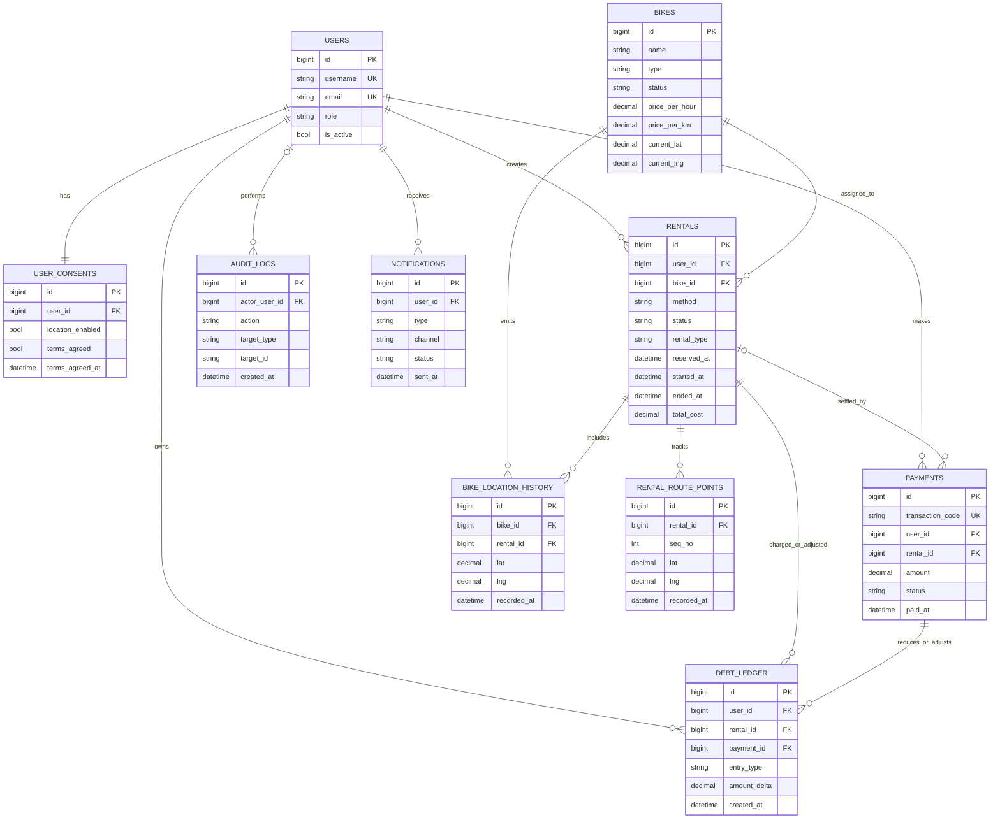

# Backend ERD and Implementation Preparation (From Frontend Analysis)

## 1. Purpose
This document converts the current frontend behavior into a backend-ready data model and implementation plan.

Scope:
- Identify entities already implied by frontend state and UI flows.
- Define proposed relational schema and relationships.
- Define lifecycle/state rules for rentals, bikes, debts, and payments.
- Provide API-first backend implementation order.

Primary frontend evidence sources:
- `frontend/src/store/useAuthStore.js`
- `frontend/src/store/useBikeStore.js`
- `frontend/src/pages/User/ManageRentals.jsx`
- `frontend/src/pages/User/PaymentPage.jsx`
- `frontend/src/pages/User/LiveTracking.jsx`
- `frontend/src/pages/Admin/AdminDashboard.jsx`
- `frontend/src/pages/Admin/UserManagement.jsx`
- `frontend/src/pages/Admin/PaymentManagement.jsx`
- `frontend/src/pages/Admin/DebtManagement.jsx`
- `frontend/src/pages/Admin/AuditLogs.jsx`
- `frontend/src/components/Auth/PermissionAgreement.jsx`
- `frontend/src/components/Bikes/BikeModal.jsx`
- `frontend/src/components/Bikes/RentalModal.jsx`
- `frontend/src/utils/bikeData.js`

## 2. Feature-Derived Domain Analysis

### 2.1 Auth and Access Control
Observed frontend behavior:
- Roles: `ADMIN`, `RIDER`.
- Rider routes are blocked until permission/terms agreement is completed.
- Token-based auth is expected in API client interceptor.

Backend implications:
- User identity table with role.
- Permission consent record per user (location + terms agreement).
- JWT/session table optional but recommended for revocation and audit.

### 2.2 Bike Fleet Management
Observed frontend behavior:
- Bike CRUD via admin.
- Bike fields: name, type, status, hourly price, per-km price, image, description, location.
- Bike statuses include at least: `AVAILABLE`, `RENTED`, `RESERVED`, `MAINTENANCE`.

Backend implications:
- `bikes` table with structured pricing and status.
- Keep current location on bike row for fast reads.
- Optional telemetry/history table for tracking updates over time.

### 2.3 Rental Lifecycle and Reservation
Observed frontend behavior:
- Rental methods: `HOURLY`, `MILEAGE`.
- Rental timing options: `IMMEDIATE`, `RESERVE_30_MIN`.
- Reservation can expire, be activated, or cancelled.
- Unlock flow uses unlock code and proximity checks.

Backend implications:
- `rentals` table should model reservation and active lifecycle in one entity.
- Must store reservation window timestamps and unlock metadata.
- Add strict state machine transitions to avoid invalid transitions.

### 2.4 Tracking and Route
Observed frontend behavior:
- Live map shows bike and user location.
- Routing fetched from OSRM on frontend (can remain client-side).
- Mileage rental may contain route checkpoints.

Backend implications:
- Persist minimal ride GPS points for billing/dispute support.
- Optional normalized route tables for per-ride route points.

### 2.5 Payment and Debt
Observed frontend behavior:
- Return bike triggers payment flow.
- Admin has payment management and debt management views.
- User profile shows outstanding debt and allows settlement.

Backend implications:
- Payments table tied to rental and user.
- Debt ledger table for incremental outstanding balance events.
- Rider current debt can be materialized as computed field or view.

### 2.6 Audit and Operations
Observed frontend behavior:
- Admin audit logs view with action type, actor, detail, timestamp.
- Debt notification action exists in admin UI.

Backend implications:
- Audit log table with actor, action type, target, metadata JSON.
- Notification table optional for debt reminders and delivery status.

## 3. Proposed Relational Data Model

## 3.1 Entity List (Core)
1. `users`
2. `user_consents`
3. `bikes`
4. `bike_location_history` (optional but recommended)
5. `rentals`
6. `rental_route_points` (optional for mileage trace)
7. `payments`
8. `debt_ledger`
9. `audit_logs`
10. `notifications` (optional)

## 3.2 Suggested Table Definitions

### `users`
- `id` (PK, bigint/uuid)
- `username` (unique, indexed)
- `full_name`
- `email` (unique, indexed)
- `phone_number`
- `campus_id` (unique, nullable)
- `role` (enum: `ADMIN`, `RIDER`)
- `avatar_url` (nullable)
- `member_since` (date/datetime)
- `is_active` (bool)
- `created_at`, `updated_at`

### `user_consents`
- `id` (PK)
- `user_id` (FK -> users.id, unique)
- `location_enabled` (bool)
- `tracking_enabled` (bool)
- `terms_agreed` (bool)
- `terms_agreed_at` (nullable datetime)
- `consent_version` (string, nullable)
- `created_at`, `updated_at`

### `bikes`
- `id` (PK)
- `name`
- `type` (enum: `CITY`, `MOUNTAIN`, `ROAD`, `ELECTRIC`)
- `status` (enum: `AVAILABLE`, `RESERVED`, `RENTED`, `MAINTENANCE`)
- `price_per_hour` (decimal)
- `price_per_km` (decimal)
- `image_url`
- `description` (text, nullable)
- `current_lat` (decimal, nullable)
- `current_lng` (decimal, nullable)
- `current_zone` (string, nullable)
- `created_at`, `updated_at`

### `bike_location_history` (optional)
- `id` (PK)
- `bike_id` (FK -> bikes.id, indexed)
- `rental_id` (FK -> rentals.id, nullable)
- `lat`, `lng`
- `zone` (nullable)
- `source` (enum: `SYSTEM`, `RIDER_APP`, `ADMIN_UPDATE`)
- `recorded_at` (datetime, indexed)

### `rentals`
- `id` (PK)
- `user_id` (FK -> users.id, indexed)
- `bike_id` (FK -> bikes.id, indexed)
- `method` (enum: `HOURLY`, `MILEAGE`)
- `status` (enum: `RESERVED`, `ACTIVE`, `COMPLETED`, `CANCELLED`, `EXPIRED`)
- `rental_type` (enum: `IMMEDIATE`, `RESERVE_30_MIN`)
- `reserved_at` (nullable datetime)
- `reservation_ends_at` (nullable datetime)
- `started_at` (nullable datetime)
- `unlocked_at` (nullable datetime)
- `ended_at` (nullable datetime)
- `unlock_code_hash` (nullable)
- `unlock_mode` (enum: `STRICT_CODE`, `PROXIMITY_ONLY`, `STAFF_OVERRIDE`, nullable)
- `start_lat`, `start_lng` (nullable)
- `end_lat`, `end_lng` (nullable)
- `distance_km` (decimal, default 0)
- `duration_seconds` (int, default 0)
- `current_cost` (decimal, default 0)
- `total_cost` (decimal, default 0)
- `created_at`, `updated_at`

### `rental_route_points` (optional)
- `id` (PK)
- `rental_id` (FK -> rentals.id, indexed)
- `seq_no` (int)
- `lat`, `lng`
- `point_name` (nullable)
- `recorded_at` (datetime)

### `payments`
- `id` (PK)
- `transaction_code` (unique, indexed; ex: `TRX-12345`)
- `user_id` (FK -> users.id, indexed)
- `rental_id` (FK -> rentals.id, nullable, indexed)
- One rental may have multiple payment attempts (retry/failure/partial settlement scenarios).
- `amount` (decimal)
- `currency` (default `THB`)
- `method` (enum: `PROMPTPAY`, `CARD`, `CASH`, `OTHER`)
- `status` (enum: `PENDING`, `COMPLETED`, `FAILED`, `REFUNDED`)
- `provider_ref` (nullable)
- `paid_at` (nullable datetime)
- `created_at`, `updated_at`

### `debt_ledger`
- `id` (PK)
- `user_id` (FK -> users.id, indexed)
- `rental_id` (FK -> rentals.id, nullable)
- `payment_id` (FK -> payments.id, nullable)
- `entry_type` (enum: `CHARGE`, `PAYMENT`, `ADJUSTMENT`, `PENALTY`, `WAIVER`)
- `amount_delta` (decimal; positive increases debt, negative reduces debt)
- `note` (nullable)
- `created_at` (datetime, indexed)

### `audit_logs`
- `id` (PK)
- `actor_user_id` (FK -> users.id, nullable for system)
- `action` (string/enum; ex: `BIKE_ADDED`, `USER_ROLE_CHANGE`)
- `target_type` (nullable; ex: `BIKE`, `USER`, `RENTAL`, `SYSTEM`)
- `target_id` (nullable)
- `detail` (text)
- `metadata_json` (json/jsonb)
- `created_at` (datetime, indexed)

### `notifications` (optional)
- `id` (PK)
- `user_id` (FK -> users.id, indexed)
- `type` (enum: `DEBT_REMINDER`, `SYSTEM_ALERT`, `RENTAL_EVENT`)
- `channel` (enum: `EMAIL`, `IN_APP`, `SMS`)
- `subject` (nullable)
- `body`
- `status` (enum: `QUEUED`, `SENT`, `FAILED`)
- `sent_at` (nullable datetime)
- `created_at`

## 4. ER Diagram (Mermaid)

Refactor notes applied:
- Payment flow changed from "one rental -> zero/one payment" to "one rental -> zero/many payments" to support retries, failed attempts, and partial/adjusted settlements.
- Optional foreign keys are represented with optional cardinality where possible (`actor_user_id`, `payments.rental_id`).
- Added missing entity blocks for `NOTIFICATIONS`, `BIKE_LOCATION_HISTORY`, and `RENTAL_ROUTE_POINTS` for diagram completeness.
- Clarified status mapping: bike `RENTED` typically corresponds to rental `ACTIVE`.

## 5. Lifecycle and State Rules

### 5.1 Bike Status Rules
- `AVAILABLE` -> `RESERVED` when reservation created.
- `AVAILABLE` -> `RENTED` when immediate rental starts.
- `RESERVED` -> `RENTED` when reservation is activated.
- `RESERVED` -> `AVAILABLE` when cancelled or expired.
- `RENTED` -> `AVAILABLE` when ride is completed and returned.
- Any state -> `MAINTENANCE` by admin operation (except if active rental exists; should be blocked unless forced).

### 5.2 Rental Status Rules
- Start states:
  - immediate: `ACTIVE`
  - reserve: `RESERVED`
- `RESERVED` -> `ACTIVE` on activation before deadline.
- `RESERVED` -> `EXPIRED` on timeout.
- `RESERVED` -> `CANCELLED` by user cancel.
- `ACTIVE` -> `COMPLETED` on return + finalized payment/debt posting.
- No transition allowed from terminal states: `COMPLETED`, `CANCELLED`, `EXPIRED`.

### 5.3 Payment and Debt Rules
- On rental completion, create charge:
  - `debt_ledger(entry_type=CHARGE, amount_delta=+total_cost)`
- On successful payment, create payment record and ledger reduction:
  - `debt_ledger(entry_type=PAYMENT, amount_delta=-paid_amount)`
- Rider current debt = `SUM(amount_delta)` for the user.
- Prevent account deletion when debt > 0.

### 5.4 Unlock Rules
- Unlock only if rental is `ACTIVE`.
- For strict mode, unlock code must match.
- Proximity constraint (<= 40m) should be verified server-side whenever reliable location is provided.
- Store unlock event timestamp for traceability.

## 6. API Contract Draft for Backend

### Auth and User
- `POST /api/auth/register`
- `POST /api/auth/login`
- `GET /api/users/me`
- `PATCH /api/users/me`
- `PUT /api/users/me/consents`
- `GET /api/users/me/debt`
- `POST /api/users/me/debt/payments`

### Bikes
- `GET /api/bikes` (supports filters: type, status, location radius)
- `POST /api/admin/bikes`
- `PATCH /api/admin/bikes/{bikeId}`
- `DELETE /api/admin/bikes/{bikeId}`

### Rentals
- `POST /api/rentals` (method + rentalType)
- `POST /api/rentals/{id}/activate`
- `POST /api/rentals/{id}/cancel`
- `POST /api/rentals/{id}/unlock`
- `POST /api/rentals/{id}/return`
- `GET /api/rentals/active`
- `GET /api/rentals/history`

### Payments and Debt (Admin)
- `GET /api/admin/payments`
- `GET /api/admin/debts`
- `POST /api/admin/debts/{userId}/notify`

### Tracking and Operations
- `POST /api/rentals/{id}/track-points` (batch points)
- `GET /api/admin/tracking/live`
- `GET /api/admin/audit-logs`

## 7. Backend Implementation Roadmap

Phase 1 (MVP data correctness):
1. Users, consents, bikes, rentals, payments, debt_ledger tables.
2. Auth + profile + bike list + create rental + return rental.
3. Server-side rental and bike state transition validation.

Phase 2 (Operations):
1. Admin bike CRUD.
2. Payment/debt management endpoints.
3. Audit logs for all admin mutations.

Phase 3 (Tracking and analytics):
1. Live location ingestion and history.
2. Route point persistence for mileage billing and disputes.
3. Notification delivery records and debt reminder automation.

## 8. Required Indexes and Constraints

Recommended unique constraints:
- `users.username`
- `users.email`
- `users.campus_id` (if mandatory)
- `payments.transaction_code`
- `user_consents.user_id`

Recommended indexes:
- `rentals(user_id, status, created_at)`
- `rentals(bike_id, status, created_at)`
- `payments(user_id, status, created_at)`
- `debt_ledger(user_id, created_at)`
- `audit_logs(created_at, action)`
- `bike_location_history(bike_id, recorded_at)`

Consistency guards:
- At most one non-terminal rental per bike (`ACTIVE` or `RESERVED`).
- At most one non-terminal rental per rider if product policy is single-bike-per-user.
- Bike status must match active rental reality.

## 9. Gaps and Clarifications Needed Before Backend Finalization

1. Should one rider be allowed multiple concurrent active rentals?
2. Is reservation fee/penalty required on expiry or cancellation?
3. Should payment be mandatory at return time, or can debt remain unpaid temporarily?
4. Which statuses are final for bike lifecycle (retired, disabled) beyond maintenance?
5. Is unlock code generated server-side only and stored hashed?
6. How strict must location verification be (trusted mobile GPS vs optional)?
7. Is debt reminder notification delivery tracking required in MVP?

## 10. Suggested Tech Choices for Backend Alignment

- Database: PostgreSQL.
- ORM: Prisma or TypeORM (Node) / JPA (Spring) with explicit enums.
- API style: REST with transactional service layer.
- Scheduler/worker:
  - Reservation expiry job.
  - Debt reminder notification job.
- Security:
  - JWT short-lived access + refresh token.
  - Rate-limited unlock and payment endpoints.

## 11. Minimal Seed Data for Integration Testing

Seed these for frontend integration:
- 1 admin user, 3 rider users.
- 6 bikes across all status variants.
- 2 active rentals, 1 reserved rental, 3 completed rentals.
- 5 payments with mixed statuses.
- 4 debt ledger entries including charge and payment adjustments.

This seed coverage maps to all current dashboard screens and allows end-to-end flow testing.

## 12. Frontend Feature Coverage Audit Against ERD

This section validates whether the current ERD supports all implemented frontend features.

### 12.1 Coverage Matrix

1. Auth + role-based routing (`ADMIN`, `RIDER`): Covered.
2. Permission gate before rider access (location + terms): Covered via `user_consents`.
3. Bike fleet CRUD (type, rates, status, location): Covered via `bikes`.
4. Bike filtering and browse list: Covered (query concern, no schema gap).
5. Rental lifecycle (`RESERVED -> ACTIVE -> COMPLETED`, cancel, expire): Covered via `rentals`.
6. Unlock flow (unlock code, unlock timestamps): Covered via `rentals.unlock_code_hash` and `unlocked_at`.
7. Payment transaction history and statuses: Covered via `payments`.
8. Debt totals and debt settlement: Covered via `debt_ledger` (+ derived balance).
9. Audit timeline (admin actions): Covered via `audit_logs`.
10. Debt reminder notifications: Covered via optional `notifications`.
11. Live tracking and ride traces: Partially covered via `bike_location_history` and `rental_route_points`.
12. Admin “User Management” summary fields (active rentals count, total spend): Partially covered as derived read models.
13. Admin profile extras (employee id style field, password-change workflow): Partially covered (requires auth/security implementation details).
14. “Terminate account” and “Privacy settings” actions in rider profile: Missing backend endpoints/policy handling (UI placeholders).

### 12.2 Refactors Needed in ERD/Backend Contract

1. Keep bike status enum as `AVAILABLE|RESERVED|RENTED|MAINTENANCE` and treat frontend `ACTIVE` as computed map-view state, not persisted bike status.
2. Add explicit read-model guidance:
    - User management fields (`activeRentals`, `totalSpend`, rider online/active marker) should be API projections derived from `rentals` + `payments`, not duplicated columns in `users`.
3. Add account lifecycle fields to `users` (recommended):
    - `deleted_at` (nullable datetime) for soft delete.
    - `deactivated_at` (nullable datetime).
4. Clarify payment source of truth:
    - Frontend currently simulates transaction IDs; backend must generate `transaction_code` and return it.
5. Clarify privacy endpoint semantics:
    - Rider profile shows privacy controls; these should update `user_consents` (especially location/tracking toggles) via dedicated endpoint.

### 12.3 Backend APIs Missing for Existing Frontend Intent

Recommended additions to align with existing UI intent:

1. `PATCH /api/users/me/privacy` (toggle tracking/location consent safely).
2. `POST /api/users/me/deactivate` (guarded by debt=0 policy).
3. `POST /api/users/me/delete-request` (or admin-reviewed deletion request).
4. `POST /api/users/me/change-password` and admin equivalent.
5. `GET /api/admin/users/summary` (active rentals, spend, last activity).

### 12.4 High-Priority Consistency Rules (Derived from Frontend Behavior)

1. Reservation expiry must be server-enforced (not only client timer).
2. Unlock should fail unless rental is `ACTIVE` and policy checks pass (code/proximity/override).
3. Bike status must be synchronized with current non-terminal rental state.
4. Return flow should atomically:
    - close rental,
    - set bike `AVAILABLE`,
    - create charge ledger entry,
    - create/update payment status if paid immediately.

### 12.5 Final Coverage Verdict

The ERD now covers the core frontend features well for MVP and operations.

Remaining gaps are mostly implementation-contract gaps (privacy/account lifecycle/profile security/read models), not major entity-model gaps.
